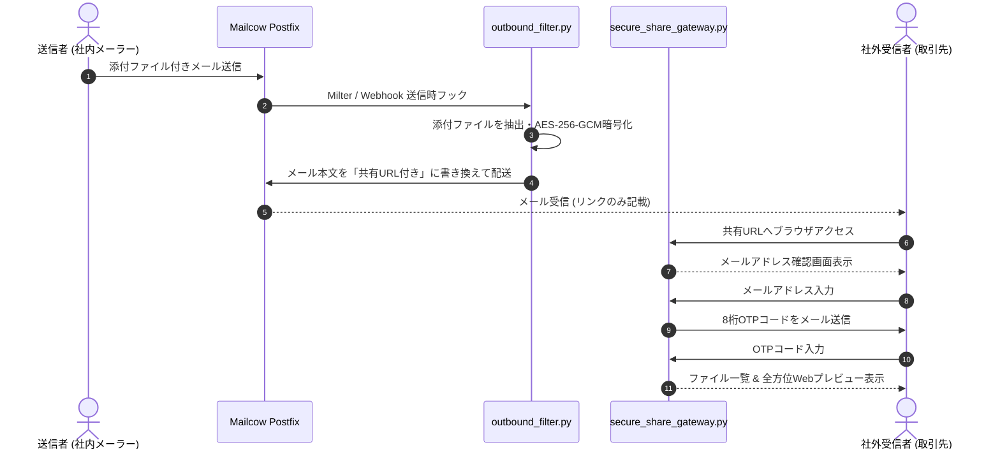

# Mailcow Secure Share Gateway (脱PPAP・高機能暗号化Web共有)

送信メールの添付ファイルを自動的に迎撃（インターセプト）し、暗号化ファイル共有リンクへと自動変換（脱PPAP）するメール連携セキュアゲートウェイです。
受信者限定のワンタイムパスワード (OTP) 二要素認証と、Office・CSV・Markdown・3D STL・SVG・PDF 等の全方位インラインWebプレビュー機能を備えています。

---

## 🌟 主な特徴

1. **完全自動の脱PPAP（パスワード付きZIP廃止）**
   - 送信メールから添付ファイルを自動分離。メール本文にセキュアな一時共有URL（`/share/{token}`）を自動挿入。
2. **AES-256-GCM 暗号化 & マスターキー保護**
   - 分離された添付ファイルはディスク保存時に AES-256-GCM で強力に暗号化。改ざん耐性を確保。
3. **受信者メールOTP二要素認証**
   - 宛先メールアドレスの所有確認（8桁ワンタイムコード送信）に成功したユーザーのみがファイルを復号・ダウンロード可能。
4. **全方位マルチフォーマット Web プレビュー**
   - ダウンロードすることなく、ブラウザ上で直ちに内容を確認：
     - **Office 文書**: docx, xlsx (Sheets/Docs レンダラー)
     - **データ・文書**: CSV / TSV（ソート・検索可能テーブル）、Markdown
     - **3D & ベクター**: 3D CAD/STL（Three.js レンダラー）、SVG、PDF、WebP/PNG/JPG

---

## 🏛 処理フロー

---

## 📄 ライセンス

本リポジトリは [MIT License](LICENSE) の下で公開されています。
